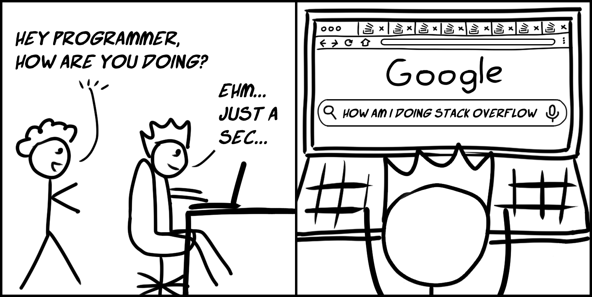

<head>
    
    
</head>

Good good study, day day up.\

- [数学](#数学)
- [English words](#english-words)
- [Japanese](#japanese)

这个帖子用来测试一下各种文字，latex数学公式等等，文章什么的以后再发。
[百度](https://www.baidu.com/)一下，你就知道。
图片其实还没有测试好，但是再说吧

## [数学](#数学)

We have $a^2+b^2=c^2$, $E=mc^2$.\
So we get:\
$\sum\limits _{i=1}^n i\quad \prod\limits _{i=1}^n$

## [English words](#english-words)

Hello World!\
AlphaGo n. 阿尔法狗

## [Japanese](#japanese)

こんにちは～\
日本語難しいね

1\
2\
3\
